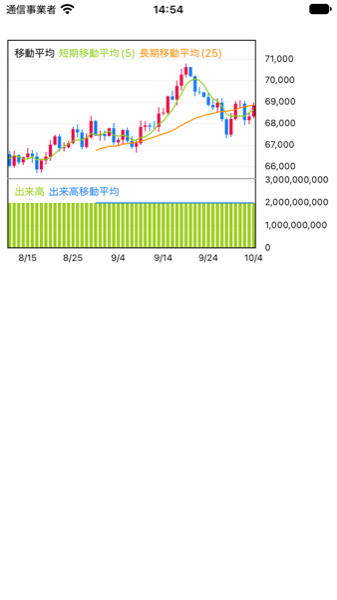
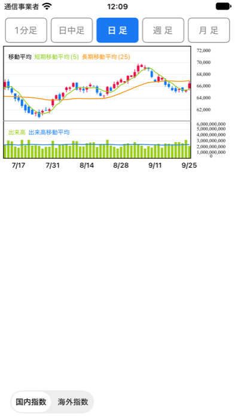
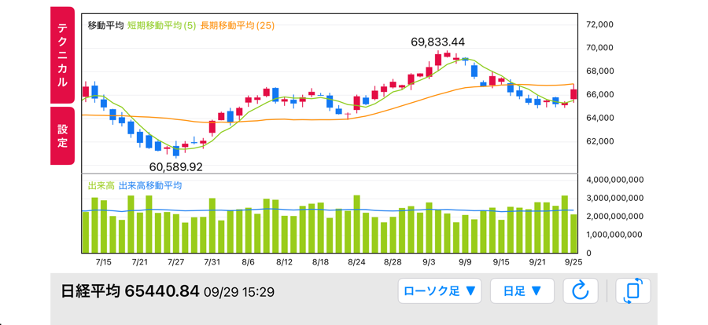

# ChartTest

[DGCharts](https://github.com/ChartsOrg/Charts) を使って株価チャート(ローソク足 + テクニカル指標)を表示する iOS アプリのサンプルです。
チャート部分(`ChartTest/StockChart/`)は、ほかのアプリにもそのまま組み込める共通部品として作っています。

- UIKit / iOS 18 以上 / 常にライトモード
- Swift と Objective-C のどちらからでも呼び出せます(「使い方」に両方の書き方があります。Objective-C のサンプルは `ChartTest/ObjCSample/`)

## 目次

| 知りたいこと | 読むところ |
|---|---|
| まず動かしたい・既存アプリに入れたい | [はじめての導入ガイド](#はじめての導入ガイド)(ステップごとに説明しています) |
| うまく動かない | [困ったとき](#困ったとき) |
| どんな画面・機能があるか | [画面](#画面) |
| 出来高・サブチャートの仕組み | [サブチャート(出来高など)](#サブチャート出来高など) |
| コードの書き方(Swift / Objective-C) | [使い方](#使い方swift--objective-c) |
| 色・文字の大きさなどを変えたい | [見た目を変える](#5-見た目を変える色文字の位置フォントの大きさ) |
| API のレスポンスを渡したい | [API のレスポンス(足種ごと)を渡す](#api-のレスポンス足種ごとを渡す) |
| ファイルの中身・仕組みを知りたい | [フォルダ構成](#フォルダ構成)・[データの流れ](#データの流れ) |

## はじめての導入ガイド

既存のアプリ(Swift でも Objective-C でも可)にチャートを入れるまでを、順番に説明します。
各ステップの最後にある **確認ポイント** のとおりになっていれば、次のステップに進んでください。うまくいかないときは [困ったとき](#困ったとき) を見てください。

### ステップ 0. 必要なもの

| もの | バージョン | 備考 |
|---|---|---|
| Xcode | 26 以上(このプロジェクトは Xcode 27 で作成) | `nonisolated` を付けたクラスなど、Swift 6.2 の書き方を使っているため、Xcode 16 以前ではビルドできません |
| iOS | 18 以上(動作確認済み) | iOS 15〜17 は未確認です |
| DGCharts | 5.1.0 以上 | チャートを描くライブラリ。ステップ 2 で追加します |
| Swift の言語モード | Swift 5 | Swift 6 の言語モードは未確認です |

### ステップ 1. まずこのサンプルを動かす

既存アプリに入れる前に、このプロジェクトで「どう動くか」を確かめます。

1. `ChartTest.xcodeproj` をダブルクリックして Xcode で開く
2. 初回は DGCharts の取得が自動で始まります。左下の進み具合の表示が消えるまで待つ
3. 画面上部の実行先で、iPhone のシミュレータ(例: iPhone 16 Pro)を選ぶ
4. **⌘R**(Product > Run)で実行する
5. シミュレータで **⌘ →**(Device > Rotate Right)を押して横向きにする

**確認ポイント**: 縦向きでは足種のタブ付きのチャート、横向きでは左に「テクニカル」「設定」タブ・下に帯のあるチャートが表示される(下の「画面」の画像と同じ見た目)。

### ステップ 2. 既存アプリに DGCharts を追加する

1. 既存アプリのプロジェクトを Xcode で開く
2. メニューの **File > Add Package Dependencies…** を選ぶ
3. 右上の検索欄に `https://github.com/ChartsOrg/Charts.git` を貼り付ける
4. **Dependency Rule** を「Up to Next Major Version」・`5.1.0` にして **Add Package** を押す
5. 次の画面で **DGCharts** の行の「Add to Target」に、既存アプリのターゲットを選んで **Add Package** を押す

**確認ポイント**: 左のファイル一覧の下の **Package Dependencies** に「Charts」が表示され、⌘B(ビルド)が成功する。

### ステップ 3. チャートの部品(`StockChart` フォルダ)をコピーする

1. Finder でこのプロジェクトの `ChartTest/StockChart/` フォルダを開く
2. フォルダごと、Xcode の左のファイル一覧(既存アプリのフォルダの中)にドラッグする
3. 出てきた画面で次のように選んで **Finish** を押す
   - **Action**(古い Xcode では **Copy items if needed**): 「Copy files to destination」(コピーする)を選ぶ。コピーせずに参照すると、元のフォルダを消したときに壊れるため
   - **Groups**: 「Create folders」(フォルダとして追加)のままでよい
   - **Targets**(古い Xcode では **Add to targets**): 既存アプリのターゲットにチェックを入れる
4. **Objective-C だけのアプリの場合**: 「Would you like to configure an Objective-C bridging header?」と聞かれたら、**Don't Create** でかまいません(Objective-C から Swift を使うだけなら不要です)
5. 使わないファイルは削除してかまいません

   | ファイル | 使わない場合は削除してよい |
   |---|---|
   | `Controller/PortraitChartViewController.swift`・`Portrait.storyboard` | 縦画面(足種のタブ付き)を使わない |
   | `Controller/LandscapeChartViewController.swift`・`Landscape.storyboard` | 横画面(下の帯付き)を使わない |
   | `View/ChartFooterView.swift`・`View/ChartFooterView.xib` | 下の帯を使わない(横画面を使う場合は必要) |

   それ以外(`Model/`・`View/`・`ChartSettingsView.xib`・`StockChartViewController.swift`・`ChartResponseLoader.swift`)は、すべて必要です。
6. ファイルがアプリのターゲットに入っているか確認する
   - **フォルダとして追加した場合**(Xcode 16 以降の既定。左の一覧で青いフォルダのアイコンになる): 中のファイルは自動でビルド・コピーされます。`StockChart` フォルダを選んで、右側の **File Inspector**(⌥⌘1)の **Target Membership** に既存アプリのターゲットのチェックが入っていれば OK です
   - **グループとして追加した場合**(黄色いフォルダのアイコン): ターゲットの **Build Phases** を開き、**Compile Sources** に `.swift` ファイルが、**Copy Bundle Resources** に `ChartSettingsView.xib`(と、使う場合は `ChartFooterView.xib`・`Landscape.storyboard` / `Portrait.storyboard`)が入っているか確認します。入っていないと、設定画面・横画面を開いたときにアプリが落ちます

**確認ポイント**: ⌘B(ビルド)が成功する。
(既存アプリに `StockCandle` や `ChartType` など同じ名前の型があるとエラーになります。[困ったとき](#困ったとき) を見てください)

### ステップ 4. Objective-C から使う準備(Objective-C のアプリだけ)

Swift のクラスを Objective-C から使うには、Xcode が自動で作るヘッダを import します。

```objc
#import "既存アプリのモジュール名-Swift.h"   // 例: アプリ名が MyApp なら "MyApp-Swift.h"
```

- モジュール名は、ターゲットの **Build Settings** で「Product Module Name」を検索すると確認できます(アプリ名に `-` や空白があると `_` に置き換わります)
- このヘッダは、Swift のファイルが1つでもターゲットに入っていれば、ビルドのときに自動で作られます(自分で作るファイルではありません)
- DGCharts のヘッダから「Empty paragraph passed to '\param' command」という警告が大量に出ることがあります。エラーではないので動作には影響しません。消したい場合は **Build Settings** の **Documentation Comments**(`CLANG_WARN_DOCUMENTATION_COMMENTS`)を **No** にします

Swift のアプリでは、この準備は不要です(同じターゲットの Swift のクラスはそのまま使えます)。

**確認ポイント**: `.m` ファイルで `#import` を書いて ⌘B が成功し、`StockChartView` と入力すると補完候補に出てくる。

### ステップ 5. いちばん簡単な表示を試す

画面にチャートを1つ置き、仮のデータを渡して表示します。新しい ViewController を作って、次のコードをそのまま貼り付けてください。

```swift
// Swift: MyChartViewController.swift
import UIKit

/// チャートを1つ表示するだけの画面(導入の動作確認用)
final class MyChartViewController: UIViewController {

    /// チャート本体
    private let chartView = StockChartView()

    override func viewDidLoad() {
        super.viewDidLoad()
        self.view.backgroundColor = .white

        // 1. チャートを画面の上のほうに置く(高さを必ず決める。高さが 0 だと何も見えない)
        self.chartView.translatesAutoresizingMaskIntoConstraints = false
        self.view.addSubview(self.chartView)
        NSLayoutConstraint.activate([
            self.chartView.topAnchor.constraint(equalTo: self.view.safeAreaLayoutGuide.topAnchor, constant: 16),
            self.chartView.leadingAnchor.constraint(equalTo: self.view.leadingAnchor, constant: 8),
            self.chartView.trailingAnchor.constraint(equalTo: self.view.trailingAnchor),
            self.chartView.heightAnchor.constraint(equalToConstant: 260),
        ])

        // 2. データを渡す(日足として表示する)
        self.chartView.setCandles(self.makeTestCandles(), period: .daily)
    }

    /// 動作確認用の仮データ(60日分。日付の古い順)
    private func makeTestCandles() -> [StockCandle] {
        var candles: [StockCandle] = []
        var close = 66_000.0
        for daysAgo in (0..<60).reversed() {
            let date = Calendar.current.date(byAdding: .day, value: -daysAgo, to: Date())!
            let open = close
            close = open + Double.random(in: -800...800)
            let high = max(open, close) + Double.random(in: 0...300)
            let low = min(open, close) - Double.random(in: 0...300)
            candles.append(StockCandle(date: date, open: open, high: high, low: low, close: close, volume: 2.0e9))
        }
        return candles
    }
}
```

```objc
// Objective-C: MyObjCChartViewController.m(.h は UIViewController を継承するだけ)
#import "MyObjCChartViewController.h"
#import "MyApp-Swift.h"   // 「既存アプリのモジュール名-Swift.h」(ステップ 4)

@interface MyObjCChartViewController ()
/// チャート本体
@property (nonatomic, strong) StockChartView *chartView;
@end

@implementation MyObjCChartViewController

- (void)viewDidLoad {
    [super viewDidLoad];
    self.view.backgroundColor = UIColor.whiteColor;

    // 1. チャートを画面の上のほうに置く(高さを必ず決める。高さが 0 だと何も見えない)
    self.chartView = [[StockChartView alloc] initWithFrame:CGRectZero];
    self.chartView.translatesAutoresizingMaskIntoConstraints = NO;
    [self.view addSubview:self.chartView];
    [NSLayoutConstraint activateConstraints:@[
        [self.chartView.topAnchor constraintEqualToAnchor:self.view.safeAreaLayoutGuide.topAnchor constant:16],
        [self.chartView.leadingAnchor constraintEqualToAnchor:self.view.leadingAnchor constant:8],
        [self.chartView.trailingAnchor constraintEqualToAnchor:self.view.trailingAnchor],
        [self.chartView.heightAnchor constraintEqualToConstant:260],
    ]];

    // 2. データを渡す(日足として表示する)
    [self.chartView setCandles:[self makeTestCandles] period:ChartPeriodDaily];
}

/// 動作確認用の仮データ(60日分。日付の古い順)
- (NSArray<StockCandle *> *)makeTestCandles {
    NSMutableArray<StockCandle *> *candles = [NSMutableArray array];
    double close = 66000;
    for (NSInteger daysAgo = 59; daysAgo >= 0; daysAgo--) {
        NSDate *date = [NSDate dateWithTimeIntervalSinceNow:-daysAgo * 24 * 60 * 60];
        double open = close;
        close = open + (double)arc4random_uniform(1600) - 800;
        double high = MAX(open, close) + arc4random_uniform(300);
        double low = MIN(open, close) - arc4random_uniform(300);
        StockCandle *candle = [[StockCandle alloc] initWithDate:date open:open high:high low:low close:close volume:2.0e9];
        [candles addObject:candle];
    }
    return candles;
}

@end
```

この画面を表示する(既存の画面から `push` / `present` する、または一時的にアプリの最初の画面にする)と、チャートが表示されます。

**確認ポイント**: 次のように、ローソク足・移動平均線・出来高が表示される(値はランダムなので、形は毎回変わります)。



### ステップ 6. 本物のデータを渡す

仮データの代わりに、API から取得したデータを渡します。やり方は2つあります。

- **A. レスポンス(辞書の配列)をそのまま渡す**(おすすめ): [`ChartResponseLoader`](ChartTest/StockChart/Controller/ChartResponseLoader.swift) に渡すと、`StockCandle` への変換・日付の並べ替えまでして描画します

  ```objc
  // Objective-C: 日足のレスポンス(NSMutableArray のままでよい)を、チャートに渡す
  [ChartResponseLoader setDailyResponse:responseArray to:self.chartView];
  ```

  ```swift
  // Swift
  ChartResponseLoader.setDailyResponse(responseArray, to: self.chartView)
  ```

  最初に、[`StockCandleResponseParser.swift`](ChartTest/StockChart/Model/StockCandleResponseParser.swift) の **キーの名前**(`Key`)と **日付の形式**(`dateFormats`)を、既存アプリのレスポンスに合わせて書き換えてください(今は仮の名前 `date`・`open`・`high`・`low`・`close`・`volume` になっています)。詳しくは「[API のレスポンス(足種ごと)を渡す](#api-のレスポンス足種ごとを渡す)」。

- **B. 自分で `StockCandle` を作って渡す**: 「[1. データを作る](#1-データを作る)」のとおり `StockCandle` の配列を作り、`setCandles(_:period:)` で渡します。**日付の古い順**に並べてください

**確認ポイント**: 既存アプリの画面と同じ値(最新の足の終値など)が、チャートに表示される。

### ステップ 7. 必要に応じて機能を足す

ここまでで「チャートだけを置く」(`StockChartView`)形の導入は完了です。必要に応じて、次の部品に置き換えます。

| やりたいこと | 使う部品 | 説明 |
|---|---|---|
| 足種(1分足〜月足)のタブを付けたい | `PortraitChartViewController` | [2. 足種のタブ付きの縦画面](#2-足種のタブ付きの縦画面portraitchartviewcontroller) |
| テクニカル(指標)の切り替え・設定画面を付けたい | `StockChartViewController` | [4. 指標メニュー・設定画面付きのチャート](#4-指標メニュー設定画面付きのチャートstockchartviewcontroller) |
| このアプリと同じ横画面(下の帯付き)を使いたい | `LandscapeChartViewController` | [横画面のチャートだけを使う場合](#横画面のチャートだけを使う場合) |
| 海外指数(NYダウなど)を表示したい | `market = .overseas` | [海外指数の場合](#海外指数の場合) |
| 色・文字の大きさを変えたい | `style` | [5. 見た目を変える](#5-見た目を変える色文字の位置フォントの大きさ) |

> **メモリリークに注意**: 横画面の `onPeriodSelect` などのクロージャ(ブロック)の中で、画面自身や `self` を使うときは、Swift は `[weak self]`、Objective-C は `__weak` を付けた変数を使ってください。詳しくは「[横画面の下の帯](#横画面の下の帯)」。

## 困ったとき

| 症状・エラーメッセージ | 原因 | 直し方 |
|---|---|---|
| `No such module 'DGCharts'` | DGCharts がターゲットに追加されていない | ステップ 2 をやり直す。ターゲットの **General > Frameworks, Libraries, and Embedded Content** に `DGCharts` があるか確認する |
| `'〇〇-Swift.h' file not found` | ヘッダの名前がモジュール名と違う | ステップ 4 のとおり、Product Module Name を確認して書き直す |
| Objective-C で `StockChartView` などが見つからない(`Unknown type name`) | `-Swift.h` を import していない、または Swift のファイルがターゲットに入っていない | `#import "〇〇-Swift.h"` を書く。Swift のファイルの **Target Membership** にチェックが入っているか確認する |
| `Invalid redeclaration of 'StockCandle'` など | 既存アプリに同じ名前の型がある | どちらかの名前を変える(Xcode で型名を右クリック > **Refactor > Rename** で、使っている箇所もまとめて変えられる) |
| ビルドで `nonisolated` に関するエラーが出る | Xcode が古い | Xcode 26 以上を使う(ステップ 0) |
| 「Empty paragraph passed to '\param' command」の警告が大量に出る | DGCharts のヘッダのコメントの書き方(動作には影響しない) | **Build Settings** の **Documentation Comments** を **No** にする |
| チャートが何も表示されない(真っ白) | チャートの高さ・幅が 0 | 高さの制約(例: 260)を付けているか確認する。storyboard に置いた場合は、View のクラスが `StockChartView` になっているか確認する |
| 「現在、指定の条件で表示できる情報はありません。」と表示される | 渡したデータが 0 件(レスポンスのキーや日付の形式が合っていない場合も、読めない件が飛ばされて 0 件になる。日付は読めても4本値が1件も読めなければ 0 件になる) | `StockCandleResponseParser` の `Key`・`dateFormats` がレスポンスと合っているか確認する |
| 出来高(サブチャート)の棒が表示されない(凡例だけ出る・段ごとない) | `volume` がすべて 0(レスポンスに `"volume"` キーがない)、海外指数を指定している、または横画面でローソク足以外のチャートを選んでいる | レスポンスのキーを `StockCandleResponseParser` の `Key.volume` に合わせる。指数の種類・チャートの種類を確認する([サブチャート(出来高など)](#サブチャート出来高など)) |
| ローソク足の並びがおかしい・日付ラベルがおかしい | データが日付の古い順になっていない | `StockCandle` の配列を日付の古い順に並べる(`ChartResponseLoader` を使うと自動で並べ替える) |
| 設定タブを押す・横画面を開くとアプリが落ちる(`Could not load NIB`) | `ChartSettingsView.xib`・`ChartFooterView.xib` がアプリに入っていない | ステップ 3 の 6. のとおり、XIB の **Target Membership** にチェックを入れる(グループの場合は **Copy Bundle Resources** に入れる) |
| 横画面・縦画面を開くとアプリが落ちる(`Could not find a storyboard named`) | storyboard がアプリに入っていない | `Landscape.storyboard` / `Portrait.storyboard` の **Target Membership** にチェックを入れる(グループの場合は **Copy Bundle Resources** に入れる) |
| 横向きにならない | アプリが横向きに対応していない | ターゲットの **General > Deployment Info** で **Landscape Left / Right** にチェックを入れる |
| 横画面を閉じたあとも、メモリが解放されない | クロージャ(ブロック)の中で、画面を強く参照している | `[weak self]` / `__weak` を使う(ステップ 7 の注意) |
| 配列を渡したらアプリが落ちた | 配列に辞書以外(文字列など)が入っている | `ChartResponseLoader` には辞書(`NSDictionary`)だけを入れた配列を渡す |


## 画面

| 縦画面 | 横画面 |
|---|---|
| 上部のタブで足種(1分足・日中足・日足・週足・月足)を切り替える。チャートは移動平均線 + 出来高 | 左端の「テクニカル」「設定」タブで、指標の切り替えや設定の変更ができる。下の帯で、チャートの種類・足種の切り替え、更新、縦画面に戻す操作ができる |
| `Portrait.storyboard` / `PortraitChartViewController` | `Landscape.storyboard` / `LandscapeChartViewController` |
|  |  |

`ViewController`(`Main.storyboard`)が縦画面用と横画面用の両方を読み込み、画面の向きに合わせて片方だけを表示します。

### 横画面のテクニカル

左端の「テクニカル」タブで、メインチャート・サブチャートの指標を選びます。選べる指標は、チャートの種類・指数の種類・足種で変わります(`MainChartIndicator.choices(for:period:)` / `SubChartIndicator.choices(for:period:)`)。

| 条件 | メインチャート | サブチャート |
|---|---|---|
| 国内指数・ローソク足・日足/週足/月足 | 移動平均線・多重移動平均線・ボリンジャーバンド・一目均衡表・パラボリック・なし | 出来高・移動平均乖離率・RSI・サイコロジカル・ストキャス・MACD・DMI・なし |
| 国内指数・ローソク足・1分足/日中足 | 移動平均線・なし | 出来高・なし |
| 国内指数・VWAP/新値足/折線チャート | なし | なし |
| 海外指数・ローソク足/折線チャート | 移動平均線・なし | なし |

選べない指標を選んでいた場合(日足で一目均衡表・MACD を表示中に 1分足 にした場合など)は、メインは移動平均線、サブは出来高(海外指数は なし)に切り替えます。足種を戻しても、元の指標には戻りません。

### 横画面の設定画面

左端の「設定」タブで開きます。指標のパラメータは**足種ごと**に設定でき、上のタブで足種を切り替えます。

| 操作 | 動き |
|---|---|
| 足種のタブ | 編集する足種を切り替える。開いたときは表示中のチャートの足種。移動平均線以外の項目では、1分足・日中足はグレーで選べない |
| −/+ ボタン・スライダー | 値を変える(値はスライダーの上に表示) |
| すべての足に反映 | 表示中の値を、この項目を設定できるすべての足種にコピーする |
| 初期値に戻す | 表示中の足種の、この項目の値を初期値に戻す |
| 決定 | 変更をチャートに反映して閉じる(決定せずに閉じた場合、変更は捨てる) |

項目ごとに設定できる値は次のとおりです(`ChartSettingsCatalog`)。

| 項目 | 設定できる値 |
|---|---|
| 移動平均線 | 短期平均線・長期平均線 |
| 多重移動平均線 | 最短期間・最長期間・本数(最短〜最長を同じ間隔で分けて引く。例: 5・75・15本なら 5 刻み) |
| ボリンジャーバンド | 期間・乖離率(σ)(1〜3。3 なら ±1σ・±2σ・±3σ) |
| 一目均衡表 | 基準線期間・転換線期間・スパン期間(先行スパン・遅行スパンをずらす本数) |
| 移動平均乖離率 | 短期平均線・長期平均線・底値ライン(%)・高値ライン(%) |
| RSI・サイコロジカル | 期間・底値ライン(%)・高値ライン(%) |
| ストキャス | 高安期間・D期間・底値ライン(%)・高値ライン(%) |
| MACD | 短期EMA・長期EMA・シグナル期間 |
| DMI | 期間 |

オプション(Y軸固定・4本値)は足種ごとではないので、パネルの中央にトグルだけを並べ、切り替えるとすぐに反映されます。

4本値をオンにすると、十字線(黒い実線)と、その足の日付・始値・高値・安値・終値を表示します(ローソク足のときだけ)。
十字線の動かし方は、触った場所で変わります。

| 触った場所 | 指でなぞる(ドラッグ) | タップ |
|---|---|---|
| 枠の内側 | 動かない | 動かない |
| 右の価格ラベルの欄(メインチャートの高さ) | 横線(価格)だけが動く | 横線だけがその高さに移動 |
| 下の日付ラベルの欄 | 縦線(日付・4本値)だけが動く | 縦線だけがその位置の足に移動 |

ドラッグで動かす線は、なぞり始めた場所で決まります(途中で別の欄に指が移っても変わりません)。
日付ラベルの欄からなぞっている間は、縦線が指に合わせてなめらかに動き(4本値・日付は指に一番近い足のもの)、指を離すと足の中心に合わせ直します。
横線はメインチャートの高さの範囲だけで動きます(サブチャートの横の欄は触っても動かず、なぞって下に移ってもメインチャートの下端で止まります)。
十字線を動かさないまま 3 秒経つと、十字線・マーカー・4本値の枠が薄くなります(もう一度動かすと元の濃さに戻ります。秒数と濃さは `style` の `crosshairFadeDelay`・`crosshairFadedAlpha` で変えられます)。

枠の内側は、4本値がオンの間もチャートのスクロール(1本指)・拡大(ピンチ)に使えます(ラベルの欄からなぞったときは、十字線だけが動き、チャートはスクロールしません)。

指数の種類(`StockChartViewController.market`)が海外指数(`.overseas`)の場合は、次のようになります(詳しくは「使い方 > 海外指数の場合」)。

- 左のリストは「オプション」と「移動平均線」だけ
- オプションは「Y軸(メイン)固定」「4本値」を表示する(サブチャートがないので Y軸(サブ)固定は出さない。オンになっていても効かない)
- 4本値は、国内指数と同じくローソク足のときだけ表示する(折線チャートではオンでも表示しない)
- 足種のタブは 日足・週足・月足 だけを並べる(海外指数は日足・週足・月足だけを使うため)

テクニカル/設定を開いている間は、パネルを画面の上端〜セーフエリアの下端まで広げ、後ろの画面(チャート・下のボタン)をグレーにします。グレーの部分をタップするとパネルが閉じます(設定画面で「決定」していない変更は捨てます)。

自分の画面に組み込む場合は、`StockChartViewController` を画面いっぱいに置き、チャート本体の位置は `chartInsets`(セーフエリアの端からの余白)で決めます。
パネルは `StockChartViewController` の View の上端〜セーフエリアの下端(`panelBottomInset` でさらにあけられます)、背景のグレーは View いっぱいに表示されます。
`LandscapeChartViewController` は、下の帯の分を `chartInsets.bottom` で空け、パネルを開いている間だけチャート部品を帯より手前に出しています(`onPanelVisibilityChange`)。

### 横画面の下の帯

```
日経平均 68309.46 10/02 15:45            [ローソク足 ▼] [月足 ▼] [↻] | [⤾]
```

帯は [`ChartFooterView`](ChartTest/StockChart/View/Controls/ChartFooterView.swift)(View)で、`Landscape.storyboard` の Footer View に置いています。配置は [`ChartFooterView.xib`](ChartTest/StockChart/View/Controls/ChartFooterView.xib) を Interface Builder で開いて編集します。
帯は見た目(ボタンの色・幅・現在値の文字)だけを担当し、メニューの中身と「押されたら何をするか」は `LandscapeChartViewController` が渡します。データの取得や画面の回転はアプリによって違うので、ボタンが押されたら `LandscapeChartViewController` の処理(クロージャ / ブロック)を呼ぶだけにしています。
「チャートの種類」「足種」のボタンの幅は、メニューの中で一番長い名前(「折線チャート」など)が1行で入る幅に固定しています(文字は縮小しません。選ぶたびに幅が変わらないようにするため)。

| 部品 | 動き | 使うもの |
|---|---|---|
| 指数名・現在値・日時 | 「日経平均 68309.46 10/02 15:45」のように表示する(現在値は小数2桁・3桁区切りなし、日時は MM/dd HH:mm) | `updatePriceInfo(name:price:date:)`(Objective-C は `updatePriceInfoWithName:price:date:`) |
| ローソク足 ▼ | チャートの種類のメニュー(下の「横画面のチャートの種類」) | `chartViewController.chartType` |
| 月足 ▼ | 足種のメニュー(国内指数は 1分足〜月足、海外指数は 日足・週足・月足。VWAP のときは 日中足 だけ、新値足・折線チャートのときは 1分足 を除く。`ChartType.periods(in:)`)。選ばれると `onPeriodSelect` が呼ばれるので、その足種のデータを取得して `setCandles(_:period:)` で渡す。ボタンの文字は、渡した足種に変わる | `onPeriodSelect` |
| ↻(更新) | `onReload` が呼ばれるので、表示中の足種(`chartViewController.period`)のデータと現在値を取得し直して渡す | `onReload` |
| ⤾(縦画面に戻す) | `onRotate` が呼ばれるので、縦画面に戻す処理をする(全画面で表示している場合は `dismiss` など) | `onRotate` |

```swift
// Swift
landscape.onPeriodSelect = { [weak landscape] period in
    // その足種のデータを API から取得して渡す(ChartResponseLoader で渡してもよい)
    landscape?.setCandles(candles, period: period)
}
landscape.onReload = { [weak self] in /* 表示中の足種のデータを取得し直して setCandles(_:period:)・updatePriceInfo を呼ぶ */ }
landscape.onRotate = { [weak self] in /* 縦画面に戻す */ }
landscape.updatePriceInfo(name: "日経平均", price: 68309.46, date: date)
```

```objc
// Objective-C
__weak LandscapeChartViewController *weakLandscape = landscape;
landscape.onPeriodSelect = ^(ChartPeriod period) {
    [ChartResponseLoader setResponse:responseArray period:period to:weakLandscape];
};
landscape.onReload = ^{ /* 取得し直す */ };
landscape.onRotate = ^{ /* 縦画面に戻す */ };
[landscape updatePriceInfoWithName:@"日経平均" price:68309.46 date:date];
```

> **メモリリークに注意**: `onPeriodSelect` などのクロージャ(ブロック)は `LandscapeChartViewController` が持ち続けます。
> 中で `landscape` 自身や、`landscape` を持っている画面(`self`)を使う場合は、Swift は `[weak landscape]` / `[weak self]`、
> Objective-C は `__weak` を付けた変数を使ってください(そのまま使うと、お互いを持ち合って解放されなくなります)。

このアプリの `ViewController.swift`(`setupLandscapeFooter`)では、SampleData のデータで動かしています。
縦画面の左下にある「国内指数/海外指数」の切り替えボタンはサンプル用で、横画面では帯と重なるので表示しません。

### 横画面のチャートの種類

下の帯の「ローソク足 ▼」ボタンで切り替えます(`ChartType`)。ローソク足以外では、テクニカル指標とサブチャートは表示しません。

- 「テクニカル」のメニューは、メインチャート・サブチャートとも「なし」だけになります(ローソク足に戻すと、それまでの選択に戻ります)
- 「設定」は使えますが、「4本値」はオンにしてもローソク足のときだけ表示されます

| 種類 | 表示 |
|---|---|
| ローソク足 | ローソク足 + テクニカル指標(メイン・サブ) |
| VWAP：線 / VWAP：点 | VWAP を線または点で表示(ローソク足は描かない)。同じ日の足で累計し、日付が変わると計算し直す。出来高が 0 のデータでは計算できないので、凡例と「現在、指定の条件で表示できる情報はありません。」を表示する。足種は **日中足** だけを選べる(ほかの足種のまま VWAP にすると、日中足に切り替える) |
| 折線チャート | 終値を線で結んだチャート(ローソク足は描かない)。現在値に破線を引く。海外指数では移動平均線を重ねられる。足種は **日中足・日足・週足・月足** だけを選べる(1分足のまま折線チャートにすると、日中足に切り替える) |
| 新値足 | 3本新値の新値足。陽線は枠だけ、陰線は塗りつぶしで、現在値に破線を引く。X軸は時間ではなく新値の本数で、50本分の幅で表示する(50本未満なら右寄せ)。表示中の足種の終値から作る。足種は **日中足・日足・週足・月足** だけを選べる(1分足は選べない。1分足のまま新値足にすると、日中足に切り替える) |

### 縦画面の足種

選べる足種は指数の種類で変わります(`IndexMarket`)。

| 指数 | タブ |
|---|---|
| 国内指数(`.domestic`) | 1分足・日中足・日足・週足・月足 |
| 海外指数(`.overseas`) | 日足・週足・月足(チャートはローソク足 + 移動平均線で、サブチャート(出来高)なし) |

足種ごとに、次の表示が変わります(`ChartPeriod`)。

| 足種 | 移動平均(短期/長期) | X軸ラベル | 初期表示 | 出来高の凡例 |
|---|---|---|---|---|
| 1分足 | 5 / 25 | 09:15 | 全件 | 出来高 |
| 日中足(5分) | 5 / 25 | 09:15 | 全件 | 出来高 |
| 日足 | 5 / 25 | 7/16 | 直近 55 本 | 出来高 |
| 週足 | 13 / 26 | 2025/9 | 直近 55 本 | 出来高(平均) |
| 月足 | 5 / 25 | 2023/9 | 全件 | 出来高(平均) |

- 出来高がすべて 0 のデータ(指数の1分足・日中足など)は、出来高の棒と線を描かず、凡例だけを表示します
- データが0件のときは、枠と凡例を残したまま「現在、指定の条件で表示できる情報はありません。」と表示します

### サブチャート(出来高など)

サブチャートは、メインチャート(ローソク足)の下にある小さい段です。**出来高は、サブチャートに出せる指標の1つ**です。

```
┌──────────────────────────────┐
│ 移動平均 短期… 長期…          │ ← メインチャート(ローソク足 + 移動平均線など)
│   ローソク足                  │
├──────────────────────────────┤
│ 出来高 出来高移動平均          │ ← サブチャート(出来高・RSI・MACD などのうち1つ)
│ ▮▮ ▮▮▮ ▮ ▮▮                  │
└──────────────────────────────┘
```

サブチャートに出せるのは `SubChartIndicator` の次の8種類で、同時に出せるのは**1つだけ**です。

出来高(`.volume`)・移動平均乖離率・RSI・サイコロジカル・ストキャス・MACD・DMI・なし(`.hidden`。サブチャートの段を消す)

#### いつ何が出るか

| 画面 | サブチャート |
|---|---|
| 縦画面(`PortraitChartViewController`)・国内指数 | **出来高**(固定。選べない) |
| 縦画面・海外指数 | なし |
| 横画面(`StockChartViewController`) | 「テクニカル」タブで選ぶ。**最初は出来高**。選べるものは足種・チャートの種類で絞られる(上の「横画面のテクニカル」の表) |

#### 出来高のデータ

サブチャート用のデータを別に渡す必要はありません。**`StockCandle` の `volume`** をそのまま使います。
API のレスポンスを `ChartResponseLoader` で渡す場合は、`"volume"` キーの値が入ります(キーがない場合は `0`。`StockCandleResponseParser`)。

#### 出来高のサブチャートに描くもの

| 描くもの | 値 | 色(`StockChartStyle`) |
|---|---|---|
| 棒(出来高) | 各足の `volume` をそのまま | `volumeColor`(黄緑) |
| 線(出来高移動平均) | 直近 25本の `volume` の平均(`IndicatorParameters.volumeMAPeriod`) | `volumeAverageColor`(青) |

- Y軸の上限は、スクロール・拡大のたびに、見えている範囲の出来高に合わせて決め直します。下限は必ず 0 です
- 凡例は、1分足・日中足・日足は「出来高 出来高移動平均」、週足・月足は「出来高(平均) 出来高移動平均」です(`ChartPeriod.indicatorParameters`)。
  チャート側では平均を計算しないので、週足・月足は API から「期間中の1日あたりの平均」の値を渡す前提です
- 出来高がすべて 0 のデータ(出来高が配信されない指数の1分足・日中足など)は、棒も線も描かず、凡例だけを表示します

`volume` を使うのは、出来高のサブチャートと VWAP だけです。ほかのサブチャートの指標は、RSI・MACD・移動平均乖離率・サイコロジカルが終値、ストキャス・DMI が高値・安値・終値から計算します(「使い方 > チャート・指標ごとに使う値」)。

#### サブチャートの処理の場所

```
StockCandle の配列
   │
   ▼ ChartContentBuilder.subContent(for:)       … 選ばれた指標の中身を作る(出来高は volumeContent)
   │    計算は TechnicalIndicators(RSI・MACD など)
   ▼
SubChartContent                                 … 線(series)・棒(bars)・基準線(referenceLines)・Y軸の範囲・書式
   │
   ▼ StockChartView+Rendering.renderSubChart    … DGCharts のデータに変換して描く
   │  StockChartView+AxisRange.updateSubAxisRange … 見えている範囲に合わせて Y軸の範囲を決める
   ▼
画面
```

| 変えたいこと | 見るところ |
|---|---|
| 出来高移動平均の本数(25) | `Model/IndicatorParameters.swift` の `volumeMAPeriod` |
| 凡例の文言 | `Model/ChartContentBuilder.swift` の `volumeContent`、足種ごとの「出来高(平均)」は `Model/ChartPeriod.swift` |
| 棒・線の色 | `StockChartStyle` の `volumeColor` / `volumeAverageColor` |
| 縦画面のサブチャートを出来高以外にする | `View/Chart/StockChartView.swift` の `setCandles(_:period:market:)` の `subIndicator` |
| 横画面で選べる指標 | `Model/ChartIndicatorType.swift` の `SubChartIndicator.choices(for:period:)` |

## 使い方(Swift / Objective-C)

チャートの部品は、Swift と Objective-C のどちらからでも呼び出せます。以下、それぞれの書き方を並べています。

### 準備(Objective-C のみ)

Swift のクラスは、Xcode が自動で作るヘッダ `<プロダクトモジュール名>-Swift.h`(このアプリでは `ChartTest-Swift.h`)を import すると使えます。

```objc
#import "ChartTest-Swift.h"
```

このヘッダは DGCharts の自動生成ヘッダ(`DGCharts-Swift.h`)も読み込みます。そこには説明が空の `\param` などがあり、ドキュメントコメントのチェックが有効だと、DGCharts のモジュールのビルド中に「Empty paragraph passed to '\param' command」などの警告が大量に出ます。
このアプリでは、ビルド設定の **Documentation Comments**(`CLANG_WARN_DOCUMENTATION_COMMENTS`)を `NO` にして、この警告を出さないようにしています。
(DGCharts のモジュールは `.m` ファイルとは別にビルドされるので、`.m` の `#pragma clang diagnostic` では止められません)

動くサンプル:

| ファイル | 内容 |
|---|---|
| [`ObjCSample/ObjCPortraitChartViewController.m`](ChartTest/ObjCSample/ObjCPortraitChartViewController.m) | 足種のタブ付きの縦画面(`PortraitChartViewController`)を使う |
| [`ObjCSample/ObjCChartViewController.m`](ChartTest/ObjCSample/ObjCChartViewController.m) | 指標メニュー付きのチャート(`StockChartViewController`)を使う |

### 1. データを作る

ローソク足1本を `StockCandle` で作り、**日付の古い順**に並べた配列を渡します。

```swift
// Swift
let candle = StockCandle(date: date, open: 66_000, high: 66_500, low: 65_800, close: 66_300, volume: 2.4e9)
let candles: [StockCandle] = [candle /* , … */]
```

```objc
// Objective-C
StockCandle *candle = [[StockCandle alloc] initWithDate:date
                                                   open:66000
                                                   high:66500
                                                    low:65800
                                                  close:66300
                                                 volume:2.4e9];
NSArray<StockCandle *> *candles = @[candle /* , … */];
```

#### `StockCandle` の各値

上の例の値は、次の意味です。

| 引数 | 意味 | 例の値 | 説明 |
|---|---|---|---|
| `date` | 足の日付・時刻 | `date` | X軸の日付ラベル・4本値の日付に使う。1分足・日中足は足の開始時刻(9:00, 9:05, …)、日足はその日、週足・月足は期間を代表する日(サンプルでは週足は金曜日、月足は1日) |
| `open` | 始値(その期間の最初の値段) | `66_000` | 66,000円 |
| `high` | 高値(その期間の一番高い値段) | `66_500` | 66,500円 |
| `low` | 安値(その期間の一番安い値段) | `65_800` | 65,800円 |
| `close` | 終値(その期間の最後の値段) | `66_300` | 66,300円。最新の足の終値が「現在値」になる |
| `volume` | 出来高(その期間に売買された株数) | `2.4e9` | 2,400,000,000株(24億株)。出来高が配信されない指数の1分足・日中足などは `0` を入れる |

- `66_000` の `_` は、Swift の数字の区切り(読みやすくするためだけのもの)で、`66000` と同じです。Objective-C では `66000` と書きます
- `2.4e9` は「2.4 × 10の9乗」= 2,400,000,000 です
- 値は `low ≦ open, close ≦ high` になるように入れてください(ローソク足のヒゲは安値〜高値、実体は始値〜終値で描かれます)
- 週足・月足の出来高に「期間中の1日あたりの平均」を入れる場合は、縦画面の凡例が「出来高(平均)」になります(`ChartPeriod`)

この1本はローソク足では次のように描かれます。終値(66,300)が始値(66,000)より高いので、陽線(赤)です。

```
  66,500 ─┬─  ← 高値(ヒゲの上端)
          │
  66,300 ┌┴┐ ← 終値(実体の上端)
         │ │    陽線(終値 > 始値)は赤、陰線(終値 < 始値)は青
  66,000 └┬┘ ← 始値(実体の下端)
          │
  65,800 ─┴─  ← 安値(ヒゲの下端)
```

#### チャート・指標ごとに使う値

どのチャート・指標も、`StockCandle` の配列だけから計算します。それぞれが使う値は次のとおりです。

| チャート・指標 | 使う値 | 描き方 | 上の例の1本の場合 |
|---|---|---|---|
| ローソク足 | 始値・高値・安値・終値 | 実体は始値〜終値、ヒゲは安値〜高値 | 65,800〜66,500 のヒゲ、66,000〜66,300 の赤い実体 |
| 折線チャート | 終値 | 各足の終値を線で結ぶ。最新の終値に現在値の破線 | 66,300 の点 |
| VWAP：線 / VWAP：点 | 高値・安値・終値・出来高・日付 | 同じ日の足の「(高値 + 安値 + 終値) ÷ 3 × 出来高」の合計 ÷ 出来高の合計。日付が変わると計算し直す | (66,500 + 65,800 + 66,300) ÷ 3 = 66,200 |
| 新値足 | 終値・日付 | 終値が直前の線を更新したときだけ線を足す(3本新値)。最新の終値に現在値の破線 | 1本だけでは線はできない(2本目以降の終値と比べて線を作る) |
| 4本値(十字線) | 日付・始値・高値・安値・終値 | 十字線の位置の足の値をそのまま表示 | 日付・66,000 / 66,500 / 65,800 / 66,300 |
| 移動平均線・多重移動平均線 | 終値 | 直近 n 本の終値の平均(短期 5本・長期 25本など) | ― |
| ボリンジャーバンド | 終値 | 直近 20本の終値の平均 ± 標準偏差 × σ | ― |
| 一目均衡表 | 高値・安値・終値 | 転換線・基準線・先行スパンは期間中の(最高値 + 最安値)÷ 2、遅行スパンは終値 | ― |
| パラボリック | 高値・安値・終値 | 高値・安値の更新に合わせて SAR を動かす | ― |
| 出来高 | 出来高 | 出来高の棒 + 直近 25本の平均線 | 2,400,000,000 の棒 |
| 移動平均乖離率・RSI・サイコロジカル・MACD | 終値 | 終値の変化から計算 | ― |
| ストキャス・DMI | 高値・安値・終値 | 期間中の高値・安値と終値から計算 | ― |

- 出来高が 0 のデータでは、出来高の棒と VWAP は描けません(凡例と「表示できる情報はありません」を表示します)
- 計算式の詳細は [`TechnicalIndicators.swift`](ChartTest/StockChart/Model/TechnicalIndicators.swift)、期間などの設定値は [`IndicatorParameters.swift`](ChartTest/StockChart/Model/IndicatorParameters.swift) にあります

動作確認用のダミーデータは `SampleData` で作れます。

```swift
let candles = SampleData.candles(for: .daily)              // Swift
```

```objc
NSArray<StockCandle *> *candles = [SampleData candlesForPeriod:ChartPeriodDaily];   // Objective-C
```

### 2. 足種のタブ付きの縦画面(PortraitChartViewController)

タブが押されたら「選ばれた足種」が知らされるので、その足種のデータを取得して渡します(横画面の下の帯と同じ形)。
データは届いたときに渡せばよく、**どのスレッドから渡してもかまいません**(通信の完了処理から直接渡せます)。

```swift
// Swift
let viewController = PortraitChartViewController.instantiate()   // Portrait.storyboard から生成
viewController.market = .domestic                                // 国内指数(海外指数なら .overseas)
viewController.onPeriodSelect = { [weak viewController] period in
    // 既存アプリの通信処理で、その足種のデータを取得する(例)
    api.fetchCandles(period) { candles in
        viewController?.setCandles(candles, period: period)      // 届いたら渡す
    }
}
viewController.reloadChart()                                     // 選択中の足種(最初は日足)を読み込む
```

```objc
// Objective-C
PortraitChartViewController *viewController = [PortraitChartViewController instantiate];
viewController.market = IndexMarketDomestic;                     // 国内指数(海外指数なら IndexMarketOverseas)
__weak PortraitChartViewController *weakViewController = viewController;
viewController.onPeriodSelect = ^(ChartPeriod period) {
    // 既存アプリの通信処理で、その足種のレスポンス(辞書の配列)を取得する(例)
    [api fetchCandlesWithPeriod:period completion:^(NSArray *responseArray) {
        [ChartResponseLoader setResponse:responseArray period:period to:weakViewController];   // 届いたら渡す
    }];
};
[viewController reloadChart];                                    // 選択中の足種(最初は日足)を読み込む
```

- `onPeriodSelect` の中で画面や `self` を使うときは、`[weak …]` / `__weak` で受けてください(使わないと、画面が解放されなくなります)
- データをその場で用意できる場合(サンプルの `SampleData` など)は、代わりに `candleLoader` に「足種を受け取って配列を返す処理」を設定することもできます(両方を設定した場合は `candleLoader` を使います)

  ```swift
  viewController.candleLoader = { period in SampleData.candles(for: period) }
  ```

作った `viewController` は、子 ViewController として画面に埋め込むか、そのまま表示します。

### 3. チャートだけを置く(StockChartView)

タブやメニューが不要な場合は、`StockChartView` を置いてデータを渡すだけです(storyboard に置く場合は、View のクラスを `StockChartView` にします)。

```swift
// Swift
let chartView = StockChartView()

chartView.setCandles(candles)                                            // 移動平均線 + 出来高
chartView.setCandles(candles, period: .weekly)                           // 足種に合った設定(週足: 移動平均 13/26 など)
chartView.setCandles(candles, mainIndicator: .bollingerBands, subIndicator: .macd)   // 指標を指定
```

```objc
// Objective-C
StockChartView *chartView = [[StockChartView alloc] initWithFrame:CGRectZero];

[chartView setCandles:candles];                                          // 移動平均線 + 出来高
[chartView setCandles:candles period:ChartPeriodWeekly];                 // 足種に合った設定
[chartView setCandles:candles
        mainIndicator:MainChartIndicatorBollingerBands
         subIndicator:SubChartIndicatorMacd];                            // 指標を指定
```

見た目の設定は、データを渡す前に行います(設定のたびに描き直されるため)。

```swift
// Swift(StockChartStyle のすべての項目を変更できる)
chartView.style.visibleCount = 55        // 初期表示本数(nil で全件)
chartView.style.minimumVisibleCount = 20 // 拡大の限界: 最低でも表示する本数(nil で制限なし)
chartView.style.maximumVisibleCount = nil // 縮小の限界: 最大で表示する本数(nil で全件まで縮小できる)
chartView.style.priceHeightRatio = 2.0   // メイン:サブ = 2:1
```

```objc
// Objective-C(よく使う項目だけ)
chartView.visibleCount = 55;             // 初期表示本数(0 以下で全件)
chartView.minimumVisibleCount = 20;      // 拡大の限界(0 以下で制限なし)
chartView.maximumVisibleCount = 0;       // 縮小の限界(0 以下で全件まで縮小できる)
chartView.priceHeightRatio = 2.0;        // メイン:サブ = 2:1
```

### 4. 指標メニュー・設定画面付きのチャート(StockChartViewController)

左端の「テクニカル」「設定」タブで、指標の切り替えや設定の変更ができます。子 ViewController として埋め込みます。

```swift
// Swift
let chartViewController = StockChartViewController()
addChild(chartViewController)
view.addSubview(chartViewController.view)          // 制約はお好みで
chartViewController.didMove(toParent: self)

chartViewController.mainIndicator = .bollingerBands
chartViewController.subIndicator = .macd
chartViewController.isTechnicalMenuEnabled = true  // テクニカル/設定タブを表示する
chartViewController.chartType = .candlestick       // チャートの種類(.vwapLine / .vwapDots / .newPrice / .lineChart)
chartViewController.market = .domestic             // 指数の種類(海外指数なら .overseas)
chartViewController.setCandles(candles, period: .daily)   // 足種を指定すると、足種ごとの設定で描画する(省略時は日足)
```

```objc
// Objective-C
StockChartViewController *chartViewController = [[StockChartViewController alloc] init];
[self addChildViewController:chartViewController];
[self.view addSubview:chartViewController.view];   // 制約はお好みで
[chartViewController didMoveToParentViewController:self];

chartViewController.mainIndicator = MainChartIndicatorBollingerBands;
chartViewController.subIndicator = SubChartIndicatorMacd;
chartViewController.isTechnicalMenuEnabled = YES;  // テクニカル/設定タブを表示する
chartViewController.chartType = ChartTypeCandlestick;  // チャートの種類
chartViewController.market = IndexMarketDomestic;     // 指数の種類(海外指数なら IndexMarketOverseas)
[chartViewController setCandles:candles period:ChartPeriodDaily];  // 足種ごとの設定で描画する
```

このアプリの横画面(`LandscapeChartViewController`)は、これを `Landscape.storyboard` に埋め込んだものです。

```swift
let landscape = LandscapeChartViewController.instantiate()            // Swift
landscape.setCandles(candles)
```

```objc
LandscapeChartViewController *landscape = [LandscapeChartViewController instantiate];   // Objective-C
[landscape setCandles:candles];
```

#### 海外指数の場合

指数の種類(`market`)に `.overseas`(Objective-C は `IndexMarketOverseas`)を指定します。**データを渡す前に**指定してください(既定は国内指数 `.domestic`)。

```swift
// Swift: 縦画面(足種のタブが 日足・週足・月足 になり、チャートはローソク足 + 移動平均線・サブチャートなし)
let portrait = PortraitChartViewController.instantiate()
portrait.market = .overseas
portrait.candleLoader = { period in loadCandles(period) }   // 実際のデータの読み込み
portrait.reloadChart()

// Swift: 横画面(テクニカルは移動平均線・なし、チャートの種類はローソク足・折線チャートだけになる)
let landscape = LandscapeChartViewController.instantiate()
landscape.chartViewController.market = .overseas
landscape.setCandles(candles, period: .daily)

// Swift: StockChartViewController を直接使う場合
chartViewController.market = .overseas
chartViewController.setCandles(candles, period: .daily)
```

```objc
// Objective-C: 縦画面
PortraitChartViewController *portrait = [PortraitChartViewController instantiate];
portrait.market = IndexMarketOverseas;
portrait.candleLoader = ^NSArray<StockCandle *> *(ChartPeriod period) {
    return [self loadCandlesForPeriod:period];   // 実際のデータの読み込み
};
[portrait reloadChart];

// Objective-C: 横画面
LandscapeChartViewController *landscape = [LandscapeChartViewController instantiate];
landscape.chartViewController.market = IndexMarketOverseas;
[landscape setCandles:candles period:ChartPeriodDaily];

// Objective-C: StockChartViewController を直接使う場合
chartViewController.market = IndexMarketOverseas;
[chartViewController setCandles:candles period:ChartPeriodDaily];
```

海外指数にすると、次のように変わります。

| 画面 | 国内指数(`.domestic`) | 海外指数(`.overseas`) |
|---|---|---|
| 縦画面の足種のタブ | 1分足・日中足・日足・週足・月足 | 日足・週足・月足 |
| 縦画面のチャート | ローソク足 + 移動平均線、サブチャートに出来高 | ローソク足 + 移動平均線(サブチャートなし。メインチャートを全高で表示) |
| 横画面のテクニカル | メイン・サブとも全項目 | メインは 移動平均線・なし、サブは なし のみ(サブチャートは表示しない) |
| 横画面のチャートの種類 | ローソク足・VWAP：線・VWAP：点・新値足・折線チャート | ローソク足・折線チャート のみ |
| 横画面の折線チャート | 終値の折れ線だけ(テクニカルは「なし」のみ) | 終値の折れ線 + 移動平均線(テクニカルで 移動平均線・なし を選べる)、現在値の破線 |
| 設定画面の項目 | オプション・メインチャート・サブチャートの全項目 | オプション・メインチャートの移動平均線 のみ |
| 設定画面のオプション | Y軸(メイン)固定・Y軸(サブ)固定・4本値 | Y軸(メイン)固定・4本値(Y軸(サブ)固定はオンでも効かない。4本値はローソク足のときだけ表示) |
| 設定画面の足種のタブ | 1分足〜月足(移動平均線以外は 1分足・日中足がグレー) | 日足・週足・月足 の3つだけ |

海外指数に切り替えたとき、選べない指標・チャートの種類を選んでいた場合は、移動平均線・サブなし・ローソク足 に切り替わります。

国内・海外を切り替えるとき(同じ画面で別の指数を表示するとき)も、`market` を変えてからデータを渡し直します。

### 5. 見た目を変える(色・文字の位置・フォントの大きさ)

チャートの見た目は、すべて `StockChartView` の `style`([`StockChart/View/Chart/StockChartStyle.swift`](ChartTest/StockChart/View/Chart/StockChartStyle.swift))で決まっています。
アプリ全体の既定値を変えるなら `StockChartStyle.swift` の初期値を書き換え、画面ごとに変えるならコードで `style` を設定します。

`style` は代入するたびに描き直されるので、まとめて変更してから1回で代入します。

```swift
// Swift
var style = chartView.style
style.legendFont = .systemFont(ofSize: 10)          // 凡例の文字を小さく
style.yAxisFont = .systemFont(ofSize: 9)            // 価格(Y軸)ラベルの文字を小さく
style.legendTopInset = 2                            // 凡例をさらに上へ
style.increasingColor = .systemRed                  // 陽線の色
style.lineColors[0] = .systemGreen                  // 短期移動平均の色
chartView.style = style
```

```objc
// Objective-C(よく使うものだけ。ほかの項目は Swift 側に @objc プロパティを追加してください)
chartView.legendFont = [UIFont systemFontOfSize:10];
chartView.yAxisFont = [UIFont systemFontOfSize:9];
chartView.legendTopInset = 2;
chartView.increasingColor = UIColor.systemRedColor;
```

このアプリの縦画面は、`PortraitChartViewController` の `applyChartStyle()` で見た目を設定しています(Y軸ラベルは Times 8pt・中央揃え、凡例は 10pt・白背景)。
チャートの大きさ(左端からの位置・高さ)は `Portrait.storyboard` の制約で決めています。

`chartView` は画面ごとに次のように取り出せます。

| 画面 | `chartView` の取り出し方 |
|---|---|
| 縦画面 | `portraitViewController.chartView`(`PortraitChartViewController`) |
| 横画面 | `landscapeViewController.chartViewController.chartView`(`LandscapeChartViewController`) |
| `StockChartViewController` | `chartViewController.chartView` |

#### 変えられる項目(`StockChartStyle`)

| 変えたいもの | 項目 | 既定値 |
|---|---|---|
| 陽線・陰線の色 | `increasingColor` / `decreasingColor` | 赤 / 青 |
| 指標の線の色(移動平均など) | `lineColors`(0 = 1本目、1 = 2本目、…) | 黄緑・オレンジ・紫・水色・ピンク |
| 出来高の棒・出来高移動平均の色 | `volumeColor` / `volumeAverageColor` | 黄緑 / 青 |
| 一目均衡表の線の色 | `ichimokuTenkanColor` など `ichimoku〜Color` | ― |
| VWAP・新値足・折線チャートの色 | `vwapColor` / `newPriceColor` / `lineChartColor` | 赤 / 青 / 青 |
| 現在値の破線の色(新値足・折線チャート) | `currentPriceLineColor` | 濃いグレー |
| 外枠・区切り線・横グリッド線の色 | `borderColor` / `dividerColor` / `gridColor` | 黒 / グレー / 薄いグレー |
| 軸ラベル・凡例タイトル(「移動平均」など)の文字色 | `textColor` | 黒 |
| 凡例のフォント(大きさ) | `legendFont` | 12pt |
| 日付(X軸)ラベルのフォント(大きさ) | `xAxisFont` | 10pt |
| 価格(Y軸)ラベルのフォント(大きさ) | `yAxisFont` | 10pt |
| 価格(Y軸)ラベルの位置(外枠の右端からの距離) | `yAxisLabelOffset` | 10pt |
| 価格(Y軸)ラベルの揃え方 | `centersYAxisLabels`(true で一番長いラベルの幅の中で中央揃え) | false(左揃え) |
| 価格(Y軸)ラベルを枠内に収める | `keepsYAxisLabelsInside`(true で下端の「0」などを上にずらす) | false |
| 凡例の背景色 | `legendBackgroundColor`(白にすると文字の後ろのグリッド線が隠れる) | 透明 |
| 最高値・最安値の表示 | `showsHighLowLabels`(表示中の範囲の最高値・最安値を、その足の上・下に表示する。ローソク足のときだけ。Objective-C は `chartView.showsHighLowLabels`) | false(横画面では true) |
| 最高値・最安値の文字のフォント | `highLowLabelFont` | 14pt |
| 4本値を薄くするまでの秒数 | `crosshairFadeDelay`(十字線を動かしてからこの秒数が経つと、十字線・マーカー・4本値の枠を薄くする。また動かすと元の濃さに戻る。0 以下なら薄くしない) | 3秒 |
| 4本値を薄くしたときの濃さ | `crosshairFadedAlpha`(0 = 見えない 〜 1 = 元の濃さ) | 0.4 |
| 4本値の日付のマーカーの画像 | `dateMarkerImage`(下の日付ラベルの欄の、縦線を指す赤い矢印の代わりに描く画像。そのままの大きさで、矢印の先を外枠の下端に合わせる) | nil(`increasingColor` で矢印の形を塗る) |
| 4本値の価格のマーカーの画像 | `yAxisMarkerImage`(右端の赤い矢印の代わりに描く画像。そのままの大きさで、横線の高さに中心を合わせる) | nil(`increasingColor` で矢印の形を塗る) |
| メインの凡例の位置(上端) | `legendTopInset`(外枠の上端からの距離) | 3pt |
| サブの凡例の位置(上端) | `subLegendTopInset`(区切り線からの距離) | 2pt |
| 凡例の位置(左端) | `legendLeadingInset`(外枠の左端からの距離) | 8pt |
| 凡例とチャートの線の間隔 | `legendBottomSpacing` | 4pt |
| 右側の価格ラベル欄の幅 | `rightAxisWidth` | 90pt |
| 下側の日付ラベル欄の高さ | `xAxisLabelHeight` | 20pt |
| 日付ラベルの数 | `xAxisLabelCount`(おおよその個数。足種ごとの値は `ChartPeriod.xAxisLabelCount`) | 7(週足・月足は 5) |
| 日付ラベル同士の間隔 | `xAxisLabelSpacing`(0 より大きいと `xAxisLabelCount` は使わず、この間隔を空けて横幅に入るだけ日付を並べる。Objective-C は `chartView.xAxisLabelSpacing`) | 0(横画面では 12pt) |
| メインとサブの高さの比 | `priceHeightRatio`(メイン : サブ = この値 : 1) | 2.0 |
| 初期表示の本数 | `visibleCount`(nil で全件。足種ごとの値は `ChartPeriod.visibleCount`) | 55 |
| 拡大の限界 | `minimumVisibleCount`(ピンチで拡大したときに、最低でも表示する本数。nil で制限なし) | 20 |
| 縮小の限界 | `maximumVisibleCount`(ピンチで縮小したときに、最大で表示する本数。nil で全件まで) | nil(全件) |

- 凡例の文字の色は、線の色と同じになります(凡例だけの色はありません)。線の色を変えると、凡例の文字の色も変わります
- 凡例の位置やフォントを変えても、チャートの線が凡例と重ならないよう、Y軸の上側の余白は自動で調整されます
- 4本値のマーカーを画像にする場合は、Assets に画像を追加して次のように設定します(Objective-C も同じプロパティ名で、`chartView` から設定できます)。

  ```swift
  let chartView = landscapeViewController.chartViewController.chartView
  chartView.dateMarkerImage = UIImage(named: "dateMarker")
  chartView.yAxisMarkerImage = UIImage(named: "priceMarker")
  ```

  ```objc
  StockChartView *chartView = landscapeViewController.chartViewController.chartView;
  chartView.dateMarkerImage = [UIImage imageNamed:@"dateMarker"];
  chartView.yAxisMarkerImage = [UIImage imageNamed:@"priceMarker"];
  ```

#### `style` 以外で決まっている見た目

| 部品 | ファイル | 項目 |
|---|---|---|
| 縦画面の足種タブ(色・文字の大きさ) | [`ChartPeriodTabView.swift`](ChartTest/StockChart/View/Controls/ChartPeriodTabView.swift) | `selectedColor`・`normalColor`、`updateSelection` 内のフォント |
| 設定画面(配置・右側の行の見た目) | [`ChartSettingsView.xib`](ChartTest/StockChart/View/Panels/ChartSettingsView.xib) | Interface Builder で開いて編集する(Content View = 画面全体、Toggle Row / Stepper Row = 右側の行の見本) |
| 横画面の下の帯(配置) | [`ChartFooterView.xib`](ChartTest/StockChart/View/Controls/ChartFooterView.xib) | Interface Builder で開いて編集する(Content View = 帯全体) |
| 横画面の下の帯(ボタンの色・文字の大きさ・現在値の書式) | [`ChartFooterView.swift`](ChartTest/StockChart/View/Controls/ChartFooterView.swift) | `baseButtonConfiguration`・`menuTitleFont`・`updatePriceInfo` |
| 設定画面の左リスト(項目・見出しの色・文字の大きさ) | [`ChartSettingsView.swift`](ChartTest/StockChart/View/Panels/ChartSettingsView.swift) | `headerColor`・`selectedRowColor`、`applyCellStyle` / `viewForHeaderInSection` 内のフォント |
| テクニカルのメニュー(見出しの色・文字の大きさ) | [`TechnicalMenuView.swift`](ChartTest/StockChart/View/Panels/TechnicalMenuView.swift) | `headerColor`・`selectedRowColor`、`makeColumn` / `applyRowStyle` 内のフォント |
| 「テクニカル」「設定」タブ | [`StockChartViewController.swift`](ChartTest/StockChart/Controller/StockChartViewController.swift) | `configureTabButton` |
| 4本値の枠(文字の大きさ・背景) | [`ChartCrosshairViews.swift`](ChartTest/StockChart/View/Crosshair/ChartCrosshairViews.swift) | `OHLCInfoView` |
| 凡例・Y軸の数値の書式(桁区切り・小数の桁数) | [`ChartAxisFormatters.swift`](ChartTest/StockChart/View/Chart/ChartAxisFormatters.swift) | `ChartNumberFormatter` |
| 凡例の文言(「短期移動平均(5)」など) | [`ChartContentBuilder.swift`](ChartTest/StockChart/Model/ChartContentBuilder.swift) | 各指標の `label` / `legendTitle` |

### Swift と Objective-C で使えるものの違い

ほとんどの機能は両方から使えます。Swift の struct(`StockChartStyle`・`IndicatorParameters` など)は Objective-C から直接扱えないため、次の違いがあります。

| 部品 | 両方から使える | Swift だけ |
|---|---|---|
| `StockCandle` | 作成(`init(date:open:high:low:close:volume:)`)、各値の読み取り | ― |
| `StockChartView` | `setCandles`(3種類)、`clear`、`visibleCount`、`minimumVisibleCount`、`maximumVisibleCount`、`priceHeightRatio`、`increasingColor`、`decreasingColor`、`dateFormat`、`noDataMessage`、`legendFont`、`xAxisFont`、`yAxisFont`、`legendTopInset`、`xAxisLabelSpacing`、`showsHighLowLabels`、`crosshairFadeDelay`、`crosshairFadedAlpha`、`dateMarkerImage`、`yAxisMarkerImage` | `style`(すべての見た目)、`displayOptions`、`display(candles:main:sub:)`、パラメータを指定する `setCandles(_:mainIndicator:subIndicator:parameters:)` |
| `StockChartViewController` | `setCandles`(足種の指定あり/なし)、`period`、`market`、`chartType`、`mainIndicator`、`subIndicator`、`isTechnicalMenuEnabled`、`chartView`、`shortMAPeriod` / `longMAPeriod` / `volumeMAPeriod`、`isMainYAxisFixed` / `isSubYAxisFixed`、`showsOHLC` | `parameters`(表示中の足種の指標の期間など)、`setParameters(_:for:)`(足種を指定)、`updateParametersForAllPeriods`(すべての足種)、`displayOptions`、`onChartTypeChange` |
| `PortraitChartViewController` | `instantiate`、`market`、`onPeriodSelect`、`setCandles(_:period:)`、`candleLoader`、`reloadChart`、`selectedPeriod`、`chartView` | ― |
| `LandscapeChartViewController` | `instantiate`、`chartViewController`、`setCandles`(足種の指定あり/なし)、`updatePriceInfo`、`onPeriodSelect`、`onReload`、`onRotate` | `onPanelVisibilityChange` |
| `SampleData` | `candles(for:)`(Objective-C: `candlesForPeriod:`)、`nikkeiLike(days:)`(Objective-C: `nikkeiLikeWithDays:`) | ― |

`StockChartViewController` の `shortMAPeriod` / `longMAPeriod` / `volumeMAPeriod` は、設定すると**すべての足種**に反映されます(読み出すと表示中の足種の値)。足種ごとに変えたい場合は、設定画面か Swift の `setParameters(_:for:)` を使います。

Swift だけの設定を Objective-C から変えたい場合は、Swift 側に `@objc` プロパティを追加してください(`StockChartView.swift` と `StockChartViewController.swift` の末尾にある「Objective-C 向け」の extension が例です)。

### enum の名前の対応

Swift の enum は、Objective-C では「型名 + ケース名」になります。

| 足種(`ChartPeriod`) | 指数の種類(`IndexMarket`) |
|---|---|
| `.oneMinute` → `ChartPeriodOneMinute`(1分足) | `.domestic` → `IndexMarketDomestic`(国内) |
| `.intraday` → `ChartPeriodIntraday`(日中足) | `.overseas` → `IndexMarketOverseas`(海外) |
| `.daily` → `ChartPeriodDaily`(日足) | |
| `.weekly` → `ChartPeriodWeekly`(週足) | |
| `.monthly` → `ChartPeriodMonthly`(月足) | |

| メインチャート(`MainChartIndicator`) | サブチャート(`SubChartIndicator`) |
|---|---|
| `.movingAverage` → `MainChartIndicatorMovingAverage`(移動平均線) | `.volume` → `SubChartIndicatorVolume`(出来高) |
| `.multipleMovingAverage` → `MainChartIndicatorMultipleMovingAverage`(多重移動平均線) | `.movingAverageDeviation` → `SubChartIndicatorMovingAverageDeviation`(移動平均乖離率) |
| `.bollingerBands` → `MainChartIndicatorBollingerBands`(ボリンジャーバンド) | `.rsi` → `SubChartIndicatorRsi`(RSI) |
| `.ichimoku` → `MainChartIndicatorIchimoku`(一目均衡表) | `.psychological` → `SubChartIndicatorPsychological`(サイコロジカル) |
| `.parabolic` → `MainChartIndicatorParabolic`(パラボリック) | `.stochastics` → `SubChartIndicatorStochastics`(ストキャス) |
| `.candleOnly` → `MainChartIndicatorCandleOnly`(なし) | `.macd` → `SubChartIndicatorMacd`(MACD) |
| | `.dmi` → `SubChartIndicatorDmi`(DMI) |
| | `.hidden` → `SubChartIndicatorHidden`(サブチャートなし) |

| チャートの種類(`ChartType`) |
|---|
| `.candlestick` → `ChartTypeCandlestick`(ローソク足) |
| `.vwapLine` → `ChartTypeVwapLine`(VWAP：線) |
| `.vwapDots` → `ChartTypeVwapDots`(VWAP：点) |
| `.newPrice` → `ChartTypeNewPrice`(新値足) |
| `.lineChart` → `ChartTypeLineChart`(折線チャート) |

## 既存アプリへの組み込み

チャート部分(`ChartTest/StockChart/`)は、ほかのアプリにそのまま組み込めるよう、ダミーデータ(`SampleData`)やサンプルの画面切り替え(`ViewController`)には依存しないように作っています。
`StockChart/Controller/` にある縦画面・横画面(`PortraitChartViewController` / `LandscapeChartViewController`)は、同じフォルダにある `Portrait.storyboard` / `Landscape.storyboard` から作る画面です。`StockChart/` フォルダごとコピーすれば storyboard も入ります。

### 手順

手順は「[はじめての導入ガイド](#はじめての導入ガイド)」にステップごとにまとめています。ここでは、組み込むときに使う機能を説明します。

### API のレスポンス(足種ごと)を渡す

既存アプリで足種ごとに取得したレスポンス(辞書の配列)は、[`ChartResponseLoader`](ChartTest/StockChart/Controller/ChartResponseLoader.swift) のメソッドでチャートに渡せます。
縦画面・横画面に関係なく、どこからでも呼べます。**どのスレッドから呼んでもかまいません**(通信の完了処理から直接呼べます。描画は自動でメインスレッドに切り替えて行います)。引数は Swift では `[[String: Any]]`、Objective-C では `NSArray<NSDictionary *> *` なので、`NSMutableArray` のまま渡せます(並び順は問いません。日付の古い順に並べ替えて描きます)。

| 足種 | Objective-C | Swift |
|---|---|---|
| 1分足 | `[ChartResponseLoader setOneMinuteResponse:array to:target]` | `ChartResponseLoader.setOneMinuteResponse(array, to: target)` |
| 日中足 | `[ChartResponseLoader setIntradayResponse:array to:target]` | `ChartResponseLoader.setIntradayResponse(array, to: target)` |
| 日足 | `[ChartResponseLoader setDailyResponse:array to:target]` | `ChartResponseLoader.setDailyResponse(array, to: target)` |
| 週足 | `[ChartResponseLoader setWeeklyResponse:array to:target]` | `ChartResponseLoader.setWeeklyResponse(array, to: target)` |
| 月足 | `[ChartResponseLoader setMonthlyResponse:array to:target]` | `ChartResponseLoader.setMonthlyResponse(array, to: target)` |
| 足種を引数で指定 | `[ChartResponseLoader setResponse:array period:ChartPeriodDaily to:target]` | `ChartResponseLoader.setResponse(array, period: .daily, to: target)` |

描画先(`target`)には、次のどれでも渡せます(`StockCandleReceiving` に対応しているもの)。

| 描画先 | 使う場面 |
|---|---|
| `StockChartView` | 既存アプリの縦画面などに、チャートだけを置く場合 |
| `StockChartViewController` | テクニカル・設定画面付きのチャートを埋め込む場合 |
| `LandscapeChartViewController` | このアプリの横画面をそのまま使う場合 |
| `PortraitChartViewController` | このアプリの縦画面(足種のタブ付き)をそのまま使う場合 |

```objc
// Objective-C: レスポンスの辞書を配列に入れて、そのまま渡す
NSMutableArray *responseArray = [NSMutableArray array];
[responseArray addObject:@{@"date": @"2026/10/01", @"open": @"66,000", @"high": @66500,
                           @"low": @65800, @"close": @"66300", @"volume": @2400000000}];
[ChartResponseLoader setDailyResponse:responseArray to:landscapeViewController];   // 横画面
[ChartResponseLoader setDailyResponse:responseArray to:self.chartView];            // 縦画面(StockChartView)
```

海外指数の場合は、描画先の `market` を先に `.overseas` にしておきます(`StockChartView` は `chartView.market`、横画面は `landscape.chartViewController.market`)。海外指数は終値だけを読むので、`.domestic` のままだと0件になります。

辞書 → `StockCandle` の変換は [`StockCandleResponseParser`](ChartTest/StockChart/Model/StockCandleResponseParser.swift)(Model)が行います。

| 項目 | 内容 |
|---|---|
| キーの名前 | `StockCandleResponseParser.Key`(今は仮の名前 `date`・`open`・`high`・`low`・`close`・`volume`。既存アプリのレスポンスに合わせて直す) |
| 日付の形式 | `StockCandleResponseParser.dateFormats`(今は仮の形式 `yyyy/MM/dd HH:mm` など。上から順に試す) |
| 値の型 | 数値(`NSNumber`)・文字列(`"66,000"` のようなカンマ付きも可)のどちらでも読める |
| 読めない件 | 日付が読めない件は飛ばす。値が読めない件は、直前の足の値で埋める(既存アプリの `値がない件の穴埋め処理` / `値がない件の穴埋め処理` と同じ)。ただし、直前の足がない先頭側の件と、値が読めた最後の足より後ろの件は飛ばす |
| 国内・海外 | 国内は始値・高値・安値・終値がすべて読めた件を有効とし、出来高がなければ 0 にする。海外は終値だけを読み、始値・高値・安値は終値と同じ値、出来高は 0 にする(既存アプリの `4本値のチェック処理` / `終値だけのチェック処理` と同じ) |
| 変換だけを使う | Swift: `StockCandleResponseParser.candles(from: array, market: .overseas)` / Objective-C: `[StockCandleResponseParser candlesFrom:array market:IndexMarketOverseas]`(`market` を省略すると国内として読む) |

※ 配列に辞書以外の要素が入っていると、受け取った時点でアプリが落ちます(Swift の `[[String: Any]]` に変換できないため)。

### 横画面のチャートだけを使う場合

縦画面は既存アプリの画面をそのまま使い、横画面のチャート(テクニカル・設定画面・下の帯付き)だけを組み込む場合です。

#### コピーするもの・しないもの

| ファイル | 必要か | 説明 |
|---|---|---|
| `StockChart/` フォルダ(`ChartSettingsView.xib`・`ChartFooterView.xib` を含む) | 必要 | チャート本体・テクニカル・設定画面・下の帯。`ChartPeriodTabView` も設定画面の足種のタブで使うので、フォルダごとコピーする |
| `StockChart/Controller/Landscape.storyboard` | 必要 | 横画面(下の帯付き)。画面のクラス `LandscapeChartViewController` は `StockChart/Controller/` に入っている。下の帯が不要なら、`StockChartViewController` を直接使ってもよい |
| `Portrait.storyboard`、`StockChart/Controller/PortraitChartViewController.swift` | 不要 | このアプリの縦画面。フォルダごとコピーした場合、`PortraitChartViewController.swift` は削除してよい |
| `ViewController.swift` / `Main.storyboard` | 不要 | このアプリの、縦横を切り替えるサンプル画面 |
| `SampleData.swift` | 不要 | 動作確認用のダミーデータ |

#### 横画面を表示する

既存の縦画面から、横画面のチャートを表示します。表示の仕方は既存アプリに合わせて選んでください。

- **ボタンなどで全画面に表示する**(参考画面の右上の回転ボタンのような使い方)

```swift
// Swift(既存の縦画面の ViewController から)
let landscape = LandscapeChartViewController.instantiate()
landscape.chartViewController.market = .domestic          // 海外指数なら .overseas(データを渡す前に指定する)
landscape.setCandles(candles, period: .daily)             // 表示中の足種のデータ(古い順)
landscape.modalPresentationStyle = .fullScreen
present(landscape, animated: true)
```

```objc
// Objective-C(既存の縦画面の ViewController から)
LandscapeChartViewController *landscape = [LandscapeChartViewController instantiate];
landscape.chartViewController.market = IndexMarketDomestic;   // 海外指数なら IndexMarketOverseas
[landscape setCandles:candles period:ChartPeriodDaily];
landscape.modalPresentationStyle = UIModalPresentationFullScreen;
[self presentViewController:landscape animated:YES completion:nil];
```

  このとき、次の2点を既存アプリ側で追加してください(`LandscapeChartViewController` はコピーしたものを直接書き換えて構いません)。

  - 横向きで表示する: `LandscapeChartViewController` に次を追加する(アプリの対応する向きに「横」が含まれている必要があります)

    ```swift
    override var supportedInterfaceOrientations: UIInterfaceOrientationMask { .landscape }
    ```

  - 閉じる操作: 下の帯の「縦画面に戻す」ボタンが押されたら呼ばれる `onRotate` で、`dismiss(animated:)` を呼ぶ

    ```swift
    landscape.onRotate = { [weak landscape] in landscape?.dismiss(animated: true) }
    ```

- **端末を横にしたときに切り替える**

  このアプリの `ViewController.swift` と同じ方法です。既存の画面に `LandscapeChartViewController` を子 ViewController として画面いっぱいに埋め込んでおき、`viewDidLayoutSubviews` で縦横を判定して、横のときだけ表示します(`ViewController.swift` の `embed` / `applyLayout` を参照)。

#### 下の帯を既存アプリのものにする場合

`Landscape.storyboard` の下の帯の代わりに既存アプリのボタン(足種・更新など)を使う場合は、`StockChartViewController` を直接埋め込み、ボタンの分の余白を `chartInsets` で空けます。チャートの種類は `chartType` で切り替えます(`LandscapeChartViewController.swift` が実装例です)。

```swift
chartViewController.chartInsets = UIEdgeInsets(top: 8, left: 0, bottom: 下のボタンの高さ + 余白, right: 8)
chartViewController.chartType = .lineChart               // 既存アプリのボタンで選ばれた種類
chartViewController.setCandles(candles, period: .weekly) // 既存アプリのボタンで選ばれた足種のデータ
```

テクニカル/設定を開いている間に既存アプリのボタンにもグレーをかけたい場合は、`onPanelVisibilityChange` でパネルの開閉を受け取り、`StockChartViewController` の View をボタンより手前に出します(`LandscapeChartViewController` の `configurePanelLayering` を参照)。

### 既存アプリ側で確認が必要なこと

| 項目 | このプロジェクトの設定 | 既存アプリで違う場合 |
|---|---|---|
| Objective-C から使う | `#import "ChartTest-Swift.h"` | ヘッダ名は `<既存アプリのモジュール名>-Swift.h` になる。Objective-C だけのアプリなら、Swift を使えるようにする設定(Bridging Header など)が必要 |
| Swift の並行処理の設定 | Default Actor Isolation = **MainActor**、Swift 5 | 既存アプリで Default Actor Isolation を指定していない(nonisolated)場合も、エラー・警告なくビルドできることを確認済み。設定を変える必要はない |
| Xcode | Xcode 27 で作成 | Xcode 26 以上が必要(Swift 6.2 の `nonisolated` を付けたクラスなどを使っているため) |
| 対応 OS | iOS 18 以上で動作確認 | iOS 15 以降の API を使っているので、それより前の OS では使えない(iOS 18 未満は未確認) |
| ダークモード | ライトモード固定 | 色はライトモード前提(白背景・黒文字)。ダークモードに対応しているアプリでは、`StockChartStyle` で見た目を調整する |
| 型の名前 | `StockCandle`・`ChartType`・`ChartPeriod` など | 既存アプリに同じ名前の型があると衝突するので、名前を変える |
| DGCharts の警告 | Documentation Comments = NO | Objective-C から使うと、DGCharts のヘッダで「Empty paragraph passed to '\param' command」などの警告が大量に出ることがある(エラーではない。「準備(Objective-C のみ)」を参照) |

## フォルダ構成

`StockChart/` が、ほかのアプリにも組み込めるチャートの部品です。それ以外は、このサンプルアプリだけで使うものです。
`StockChart/` の中は、役割ごとに **Model**(計算とデータ)・**View**(画面の部品)・**Controller**(状態を持ち、Model と View をつなぐ)に分けています。

```
ChartTest/
├─ ViewController.swift                 … サンプル: 縦/横の画面を切り替える画面
├─ SampleData.swift                     … サンプル: 動作確認用のダミーデータ
├─ ObjCSample/                          … サンプル: Objective-C から使う例
│
└─ StockChart/                          ★ チャートの部品(ほかのアプリにはこのフォルダごとコピーする)
   │
   ├─ Model/                            計算とデータ(画面の部品には依存しない)
   │   ├─ StockCandle.swift                 ローソク足1本分のデータ
   │   ├─ StockCandleResponseParser.swift   API のレスポンス → StockCandle の配列
   │   ├─ ChartPeriod.swift                 足種(1分足〜月足)・指数の種類(国内/海外)
   │   ├─ ChartType.swift                   チャートの種類(ローソク足・折線チャート など)
   │   ├─ ChartIndicatorType.swift          指標の種類(移動平均線・RSI など)
   │   ├─ IndicatorParameters.swift         指標のパラメータ(期間など)
   │   ├─ TechnicalIndicators.swift         指標の計算式
   │   ├─ ChartContent.swift                「何を描くか」を表すデータ
   │   ├─ ChartContentBuilder.swift         データ + 指標 → 「何を描くか」を組み立てる
   │   ├─ ChartDisplayOptions.swift         表示オプション(Y軸固定・4本値)
   │   └─ ChartSettingsCatalog.swift        設定画面に並べる項目
   │
   ├─ View/                             画面の部品
   │   ├─ Chart/                            チャート本体
   │   │   ├─ StockChartView.swift              ★ チャート本体の入口
   │   │   ├─ StockChartView+Layout.swift       部品の配置
   │   │   ├─ StockChartView+Rendering.swift    描画・凡例
   │   │   ├─ StockChartView+AxisRange.swift    スクロール/ズームと、Y軸の範囲
   │   │   ├─ StockChartView+HighLowLabels.swift 最高値・最安値の文字
   │   │   ├─ StockChartStyle.swift             ★ 見た目の設定(色・フォント・余白など)
   │   │   ├─ ChartAxisFormatters.swift         軸ラベル・価格などの書式
   │   │   └─ Renderers/                        DGCharts の描き方を変える部品(ふだんは触らない)
   │   │       ├─ CloudCombinedRenderer.swift       一目均衡表の雲
   │   │       ├─ LatestAlignedXAxisRenderer.swift  日付ラベルの並べ方
   │   │       ├─ AlignedYAxisRenderer.swift        価格ラベルの揃え方
   │   │       └─ SafePinchCombinedChartView.swift  ピンチのクラッシュ対策
   │   ├─ Crosshair/                        4本値(十字線)
   │   │   ├─ StockChartView+Crosshair.swift    十字線の操作・配置
   │   │   └─ ChartCrosshairViews.swift         十字線・4本値の枠・マーカーの部品
   │   ├─ Panels/                           左のタブで開くパネル
   │   │   ├─ TechnicalMenuView.swift           テクニカル(指標の選択メニュー)
   │   │   └─ ChartSettingsView.swift / .xib    設定画面
   │   └─ Controls/                         チャートの外に置く操作部品
   │       ├─ ChartPeriodTabView.swift          足種のタブ(縦画面の上・設定画面の上)
   │       └─ ChartFooterView.swift / .xib      横画面の下の帯
   │
   ├─ Controller/                       状態を持ち、Model と View をつなぐ
   │   ├─ StockChartViewController.swift    ★ テクニカル・設定画面付きのチャート
   │   ├─ PortraitChartViewController.swift 縦画面(+ Portrait.storyboard)
   │   ├─ LandscapeChartViewController.swift 横画面(+ Landscape.storyboard)
   │   └─ ChartResponseLoader.swift         API のレスポンスをチャートに渡す
   │
   └─ Common/                           Model・View・Controller の共通部品
       └─ MainThread.swift                  データを受け取る入口を、必ずメインスレッドで動かす

docs/images/                            README の画像
```

★ は、使うとき・見た目を変えるときに、最初に見るファイルです。

### やりたいことから探す

| やりたいこと | 見るファイル |
|---|---|
| 色・フォント・余白を変えたい | `View/Chart/StockChartStyle.swift` |
| 足種ごとの移動平均の期間・初期表示本数を変えたい | `Model/ChartPeriod.swift` |
| 指標の計算式を確かめたい | `Model/TechnicalIndicators.swift` |
| サブチャート(出来高など)の中身・凡例を変えたい | `Model/ChartContentBuilder.swift`(`subContent(for:)`)。詳しくは [サブチャート(出来高など)](#サブチャート出来高など) |
| 凡例の文言(「短期移動平均(5)」など)を変えたい | `Model/ChartContentBuilder.swift` |
| API のレスポンスのキーの名前・日付の形式を合わせたい | `Model/StockCandleResponseParser.swift` |
| 設定画面に並べる項目・値の範囲を変えたい | `Model/ChartSettingsCatalog.swift` |
| 設定画面・下の帯の配置を変えたい | `View/Panels/ChartSettingsView.xib`・`View/Controls/ChartFooterView.xib`(Interface Builder で開く) |
| 4本値(十字線)の動きを変えたい | `View/Crosshair/StockChartView+Crosshair.swift` |
| テクニカル/設定パネルの開き方を変えたい | `Controller/StockChartViewController.swift` |
| 横画面の下の帯のボタンの動きを変えたい | `Controller/LandscapeChartViewController.swift` |

### Model(`StockChart/Model/`)

| ファイル | 内容 |
|---|---|
| `StockCandle.swift` | ローソク足1本分のデータ(日付・始値・高値・安値・終値・出来高) |
| `StockCandleResponseParser.swift` | API のレスポンス(辞書の配列)を `StockCandle` の配列に変換する(キーの名前・日付の形式はここで決める) |
| `TechnicalIndicators.swift` | 指標の計算(移動平均・ボリンジャーバンド・一目均衡表・RSI・MACD・VWAP・新値足 など) |
| `ChartType.swift` | チャートの種類(ローソク足・VWAP：線・VWAP：点・新値足・折線チャート) |
| `ChartIndicatorType.swift` | 指標の種類(メインチャート用 / サブチャート用) |
| `ChartPeriod.swift` | 足種(1分足〜月足)と足種ごとの表示の違い、指数の種類(国内/海外)ごとに選べる足種 |
| `IndicatorParameters.swift` | 指標の計算パラメータ(期間など) |
| `ChartContent.swift` | チャートに「何を描くか」を表すデータ(線・棒・雲・凡例の文字) |
| `ChartContentBuilder.swift` | ローソク足 + チャートの種類 + 指標 + パラメータ → `ChartContent` を組み立てる |
| `ChartDisplayOptions.swift` | 表示オプション(Y軸固定・4本値) |
| `ChartSettingsCatalog.swift` | 設定画面に並べる項目と、編集できるパラメータ・設定できる足種の定義 |

### View(`StockChart/View/`)

| フォルダ | ファイル | 内容 |
|---|---|---|
| `Chart/` | `StockChartView.swift` | **チャート本体**。外から呼ぶ入口とプロパティ |
| | `StockChartView+Layout.swift` | 部品の配置(Auto Layout)と見た目の設定 |
| | `StockChartView+Rendering.swift` | `ChartContent` を DGCharts のデータに変換して描く・凡例を作る |
| | `StockChartView+AxisRange.swift` | スクロール/ズームの同期と、Y軸の範囲の調整 |
| | `StockChartView+HighLowLabels.swift` | 表示中の範囲の最高値・最安値を、その足の上・下に表示する |
| | `StockChartStyle.swift` | 見た目の設定(色・フォント・余白・初期表示本数・拡大縮小の限界) |
| | `ChartAxisFormatters.swift` | 軸ラベルの書式(X軸の日付・Y軸の数値)と、価格などの数値の書式(`ChartNumberFormatter`) |
| `Chart/Renderers/` | `CloudCombinedRenderer.swift` | 一目均衡表の雲を塗るための描画処理 |
| | `LatestAlignedXAxisRenderer.swift` | 日付(X軸)ラベルを、最新の足を基準に並べる描画処理 |
| | `AlignedYAxisRenderer.swift` | 価格(Y軸)ラベルの中央揃え・枠内に収める描画処理 |
| | `SafePinchCombinedChartView.swift` | ピンチ開始時のクラッシュ(DGCharts の不具合)を防いだチャート |
| `Crosshair/` | `StockChartView+Crosshair.swift` | 表示オプションの反映と、十字線・4本値の表示・操作 |
| | `ChartCrosshairViews.swift` | 十字線・4本値の枠・マーカーの部品 |
| `Panels/` | `TechnicalMenuView.swift` | 指標の選択メニュー(テクニカルタブ) |
| | `ChartSettingsView.swift` / `.xib` | 設定画面(設定タブ)。画面の配置(足種のタブ・行・下のボタン)と、右側の行の見本(トグル行・数値行)は XIB で編集する |
| `Controls/` | `ChartPeriodTabView.swift` | 足種のタブ(縦画面の上部・設定画面の上部) |
| | `ChartFooterView.swift` / `.xib` | 横画面の下の帯(指数名・現在値、チャートの種類・足種・更新・縦画面に戻すのボタン)。配置は XIB で編集する |

### Controller(`StockChart/Controller/`)

| ファイル | 内容 |
|---|---|
| `ChartResponseLoader.swift` | API のレスポンス(足種ごと)を、どこからでもチャートに渡して描画するユーティリティ(描画先は `StockCandleReceiving`) |
| `PortraitChartViewController.swift` | 縦画面(足種のタブ + StockChartView)。`Portrait.storyboard` から作る |
| `LandscapeChartViewController.swift` | 横画面(StockChartViewController を埋め込み、下の帯(指数名・現在値、チャートの種類・足種・更新・縦画面に戻す)を付ける)。`Landscape.storyboard` から作る |
| `StockChartViewController.swift` | 足種・チャートの種類・選択中の指標・パラメータ(足種ごと)・表示オプションを持ち、メニューや設定画面の操作を受けてチャートを描き直す |
| `Portrait.storyboard` / `Landscape.storyboard` | 縦画面・横画面のレイアウト(Interface Builder で開いて編集する) |

## データの流れ

```
StockCandle の配列(ローソク足データ)
   │
   ▼  ChartContentBuilder(Model)
   │    TechnicalIndicators で指標を計算し、
   │    「どの線を・どの名前で・どの色の役割で描くか」を決める
   ▼
MainChartContent / SubChartContent(何を描くか)
   │
   ▼  StockChartView.display(...)(View)
   │    DGCharts のデータに変換して描く。
   │    色の役割(ChartColorRole)は StockChartStyle で実際の色に変換する
   ▼
画面
```

横画面では、`StockChartViewController` がメニュー・設定画面の操作を受け取り、状態を変えて上の流れをもう一度実行します。

## 初めて読むときのおすすめの順番

1. `StockChart/Model/StockCandle.swift` と `ChartContent.swift` … 扱うデータの形
2. `StockChart/Model/ChartContentBuilder.swift` … 指標から「何を描くか」を作るところ
3. `StockChart/View/Chart/StockChartView.swift` … チャート本体の入口(冒頭のコメントに全体図があります)
4. 同じフォルダの `StockChartView+Layout.swift` → `+Rendering.swift` → `+AxisRange.swift` → `View/Crosshair/StockChartView+Crosshair.swift`
5. `StockChart/Controller/StockChartViewController.swift` … 横画面のメニュー・設定の制御

指標の計算式を知りたいときは `TechnicalIndicators.swift` を見てください(各関数のコメントに式があります)。

## コードの書き方の約束

- 三項演算子(`a ? b : c`)や、`&&` を何行もつなげた条件式は使わない。`if` / `guard` / `switch` で1条件ずつ書く
- 1〜2文字の変数名は使わず、意味のわかる名前にする(ループの `i` / `j` を除く)
- 自分のプロパティ・メソッドには `self.` を付ける(UIKit から引き継いだ `view` / `bounds` / `addSubview` なども含む)。
  ローカル変数・引数と区別しやすくするため。`if let x {` のような省略形は、そのまま使ってよい。
  まとめて付ける場合は SwiftFormat を使う: `swiftformat ChartTest --rules redundantSelf --self insert --swiftversion 5.0`
  (SwiftFormat は、別ファイル・別の extension で宣言したメンバーや、`if let` / `guard let` の右側には付けないので、残りは手で付ける)
